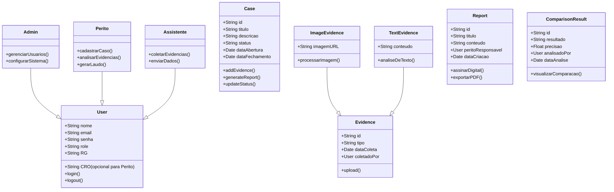

# ODX Backend

Este é um projeto backend para um sistema de gestão de casos forenses.

## Principais Tecnologias Utilizadas
- Node.js
- Express
- MongoDB
- TypeScript
- bcryptjs (para hashing de senhas)
- cors (para controle de acessos)
- dotenv (para configuração de variáveis de ambiente)

## Como Rodar o Projeto

1. Clone este repositório:
   ```sh
   git clone https://github.com/seu-usuario/odx-backend.git
   cd odx-backend
   ```

2. Instale as dependências:
   ```sh
   npm install
   ```

3. Configure as variáveis de ambiente criando um arquivo `.env` e preenchendo-o conforme necessário.
    Exemplo:
   ```env
   PORT=5000
   MONGO_URI=sua_string_de_conexao
   ```

4. Inicie o servidor:
   ```sh
   npm run dev
   ```

## Rotas da API
✅ = Requer token de autenticação JWT  
❌ = Acesso público

### 🔐 Autenticação

| Método | Rota                   | Descrição                          | Autenticação |
|--------|------------------------|-------------------------------------|--------------|
| POST   | `/auth/register`       | Registra um novo usuário           | ❌ (publica temporariamente) |
| POST   | `/auth/login`          | Login de usuário                   | ❌           |
| POST   | `/auth/logout`         | Logout do sistema                  | ✅           |
| GET    | `/auth/listusers`      | Lista todos os usuários            | ✅           |

---

### 👤 Admin

| Método | Rota                             | Descrição                           | Autenticação |
|--------|----------------------------------|--------------------------------------|--------------|
| POST   | `/user/admin/gerenciar-usuarios` | Gerencia usuários do sistema         | ✅ Admin      |
| POST   | `/user/admin/configurar-sistema` | Configurações administrativas gerais | ✅ Admin      |
| POST   | `/user/admin/registrar-usuario`  | Registra um novo usuário             | ✅ Admin      |

---

### 🧑‍⚕️ Perito

| Método | Rota                                | Descrição                                 | Autenticação |
|--------|-------------------------------------|--------------------------------------------|--------------|
| POST   | `/user/perito/cadastrar-caso`       | Cadastra um novo caso                      | ✅ Perito     |
| POST   | `/user/perito/analisar-evidencias`  | Analisa evidências de um caso              | ✅ Perito     |
| POST   | `/user/perito/gerar-laudo/:caseId`  | Gera laudo pericial de um caso             | ✅ Perito     |
| GET    | `/user/perito/listar-casos`         | Lista todos os casos atribuídos ao perito  | ✅ Perito     |
| GET    | `/user/perito/buscar-casos`         | Busca casos por critérios específicos      | ✅ Perito     |
| GET    | `/user/perito/visualizar-caso/:caseId` | Visualiza detalhes de um caso específico | ✅ Perito     |

---

### 🧑‍🔬 Assistente

| Método | Rota                                     | Descrição                           | Autenticação  |
|--------|------------------------------------------|--------------------------------------|---------------|
| POST   | `/user/assistente/coletar-evidencias`    | Coleta evidências de um caso         | ✅ Assistente  |
| POST   | `/user/assistente/enviar-dados`          | Envia dados e evidências coletadas   | ✅ Assistente  |

---

### 🧾 Evidências

| Método | Rota                           | Descrição                                  | Autenticação |
|--------|--------------------------------|---------------------------------------------|--------------|
| POST   | `/evidence/image-evidencia`    | Upload de imagem de evidência               | ✅            |

---

### 📄 Laudos

| Método | Rota                           | Descrição                                  | Autenticação |
|--------|--------------------------------|---------------------------------------------|--------------|
| POST   | `/report/:reportId/pdf`        | Exporta laudo em PDF                        | ✅            |

---

## Modelo do Banco de Dados


