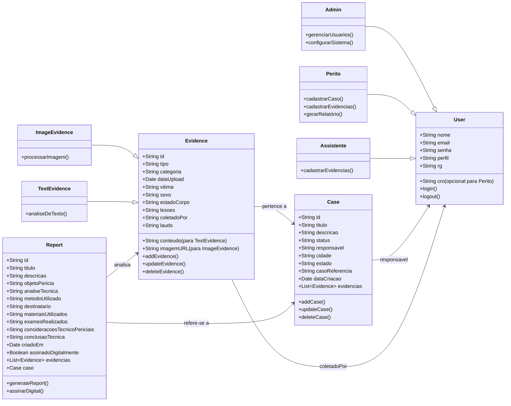

# ODX Backend

Este é um projeto backend para um sistema de gestão de casos forenses.

🔗 **API em Produção**: [https://odx-pericias-back.onrender.com](https://odx-pericias-back.onrender.com)

🔗 **Documentação da API**: [https://odx-pericias-back.onrender.com/api-docs](https://odx-pericias-back.onrender.com/api-docs)

## Principais Tecnologias Utilizadas
- Node.js
- Express
- MongoDB
- TypeScript
- bcryptjs (para hashing de senhas)
- cors (para controle de acessos)
- dotenv (para configuração de variáveis de ambiente)

## Como Rodar o Projeto

1. Clone este repositório:
   ```sh
   git clone https://github.com/seu-usuario/odx-backend.git
   cd odx-backend
   ```

2. Instale as dependências:
   ```sh
   npm install
   ```

3. Configure as variáveis de ambiente criando um arquivo `.env` e preenchendo-o conforme necessário.
    Exemplo:
   ```env
   PORT=5000
   MONGO_URI=sua_string_de_conexao
   ```

4. Inicie o servidor:
   ```sh
   npm run dev
   ```

## Modelo do Banco de Dados



